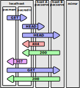
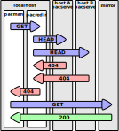

pacredir - request flow
=======================

[⬅️ Go back to main README](README.md)

Whenever `pacman` sends a request to `pacredir` a number of requests
(increasing with the number of hosts found) is sent through the network.
Let's assume `pacredir` knows about two hosts.

OK - serving from local network
-------------------------------

In this exemple one hast (`host A`) is missing the file, but second
one (`host B`) does have the file.

For database files the decision on what return code (`307` vs. `404`) to
send is made on the file age. The local file's timestamp is compared to
what timestamp `pacman` sends in its request.

After the initial request `pacman` is redirected to `host B` and gets the
file there. No request is sent to the mirror.

FAIL - fallback to mirror
-------------------------

In this example no host has the file or the local database files are older
than what `pacman` requested.

All requests made by `pacredir` are answered with http code `404`, thus
`pacman` receives the same. Finally `pacman` falls back to the next mirror.

---
[⬅️ Go back to main README](README.md)  
[⬆️ Go back to top](#top)
