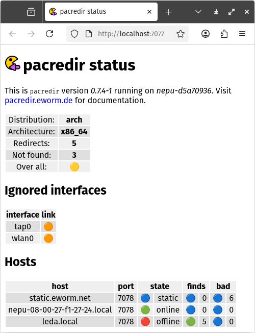
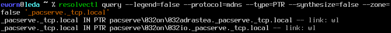
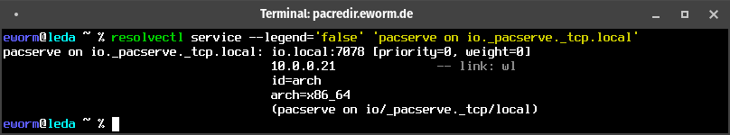

pacredir
========

**pacredir - redirect pacman requests, assisted by mDNS Service Discovery**

By default every [Arch Linux ↗️](https://archlinux.org/) installation
downloads its package files from online mirrors, transferring all the
bits via WAN connection.

But often other Arch systems may be around that already have the files
available on local storage - just a fast LAN connection away. This is
where `pacredir` can help.
It uses [mDNS Service Discovery ↗️](https://www.freedesktop.org/software/systemd/man/latest/systemd.dnssd.html)
by [systemd-resolved ↗️](https://www.freedesktop.org/software/systemd/man/latest/systemd-resolved)
to find other instances and redirect `pacman` there if available.

*Use at your own risk*, pay attention to
[license and warranty](#license-and-warranty), and
[disclaimer on external links](#disclaimer-on-external-links)!

Requirements
------------

To compile and run `pacredir` you need:

* [systemd ↗️](https://www.github.com/systemd/systemd)
* [libmicrohttpd ↗️](https://www.gnu.org/software/libmicrohttpd/)
* [curl ↗️](https://curl.haxx.se/)
* [iniparser ↗️](https://github.com/ndevilla/iniparser)
* [darkhttpd ↗️](https://unix4lyfe.org/darkhttpd/)

And these are build time or make dependencies:

* [markdown ↗️](https://daringfireball.net/projects/markdown/) (HTML documentation)
* [resvg ↗️](https://github.com/linebender/resvg) (render the favicon)
* [oxipng ↗️](https://github.com/shssoichiro/oxipng) (optimize the favicon)

`Arch Linux` installs development files for the packages by default, so
no additional development packages are required.

Build and install
-----------------

Building and installing is very easy. Just run:

    make

followed by:

    make install

This will place an executable at `/usr/bin/pacredir`,
documentation can be found in `/usr/share/doc/pacredir/`.
Additionally systemd service files are installed to
`/usr/lib/systemd/system/`.

You can not have `systemd-resolved` and the *avahi* daemon announce services
at the same time. If you really, *really* need the *avahi* daemon running
install the compatibility files:

    make install-avahi

> ℹ️ **Info**: This is packaged as `pacredir` (and `pacredir-avahi` for the
> compatibility files) in [Arch Linux ↗️](https://archlinux.org/) and derived
> distributions. Install with:  
> `pacman -Syu pacredir`

Usage
-----

Make sure *mDNS* is enabled in `systemd-resolved`, and also make sure it
is enabled for all interface you want to use this with. Run `resolvectl`
to get an overview.

Then enable and start systemd services `pacserve` and `pacredir`, allow
TCP port `7078` in your firewall and add the following line to your
repository definitions in `pacman.conf`:

    Include = /etc/pacman.d/pacredir

To get a better idea what happens in the background have a look at
[the request flow chart](FLOW.md).

### Status page

A simple status page is available when `pacredir` is running. Just point
your browser to [your local instance](http://localhost:7077/).

The instance is listening on `localhost` only. To access it from a different
host you need to proxy (for example reverse proxy with `nginx`) or tunnel
it. The latter can be used ad hoc, for example with `ssh` local forwarding:

    ssh -L 17077:localhost:7077 host

Then point your browser to `http://localhost:17077/`. A desktop file for
that url is installed, so your desktop environment has a shortcut.

### Databases from cache server

By default databases are not fetched from cache servers. To make that
happen just add the server twice, additionally as regular server. This
is prepared in `/etc/pacman.d/pacredir`, just uncomment the corresponding
line.

Do not worry if `pacman` reports the following after the change:

    error: failed retrieving file 'core.db' from 127.0.0.1:7077 : The requested URL returned error: 404 Not Found

This is ok, it just tells `pacman` that `pacredir` could not find a file
and downloading it from an official server is required.

Please note that `pacredir` redirects to the most recent database file
found on the local network if it is not too old (currently 24 hours). To
make sure you really do have the latest files run `pacman -Syu` *twice*.

Security
--------

There is no security within this project, information and file content
is transferred unencrypted and unverified. Anybody is free to serve
broken and/or malicious files to you, but this is by design. So make
sure `pacman` is configured to check signatures! It will then detect if
anything goes wrong.

Querying `systemd-resolved`
---------------------------

You may want to query `systemd-resolved` directly to verify the results.
This will list all instances:

    resolvectl query --legend='false' --protocol='mdns' --type='PTR' --synthesize='false' --zone='false' '_pacserve._tcp.local'

(The escape sequence `\032` represents a space.)

For details on the services you can query each:

    resolvectl service --legend='false' --interface='interface' 'pacserve on host._pacserve._tcp.local'

License and warranty
--------------------

This program is free software: you can redistribute it and/or modify
it under the terms of the GNU General Public License as published by
the Free Software Foundation, either version 3 of the License, or
(at your option) any later version.

This program is distributed in the hope that it will be useful,
but WITHOUT ANY WARRANTY; without even the implied warranty of
MERCHANTABILITY or FITNESS FOR A PARTICULAR PURPOSE.  See the
[GNU General Public License](COPYING.md) for more details.

Disclaimer on external links
----------------------------

Our website contains links to the websites of third parties ("external
links"). As the content of these websites is not under our control, we
cannot assume any liability for such external content. In all cases, the
provider of information of the linked websites is liable for the content
and accuracy of the information provided. At the point in time when the
links were placed, no infringements of the law were recognisable to us.
As soon as an infringement of the law becomes known to us, we will
immediately remove the link in question.

> 💡️ **Hint**: All external links are marked with an arrow pointing
> diagonally in an up-right (or north-east) direction (↗️).

### Upstream

URL:
[GitHub.com](https://github.com/eworm-de/pacredir#pacredir)

Mirror:
[eworm.de](https://git.eworm.de/cgit.cgi/pacredir/about/)
[GitLab.com](https://gitlab.com/eworm-de/pacredir#pacredir)

---
[⬆️ Go back to top](#top)
